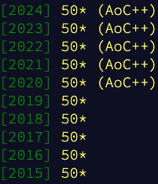

# advent of code           

fmmr solutions for Advent of code.

20200121:

## 2020

[AOC](https://adventofcode.com/2020),
[Implementations](https://github.com/fmmr/advent/tree/master/src/main/kotlin/no/rodland/advent_2020),
[Tests](https://github.com/fmmr/advent/tree/master/src/test/kotlin/no/rodland/advent_2020)

## 2019

[AOC](https://adventofcode.com/2019),
[Implementations](https://github.com/fmmr/advent/tree/master/src/main/kotlin/no/rodland/advent_2019),
[Tests](https://github.com/fmmr/advent/tree/master/src/test/kotlin/no/rodland/advent_2019)

## 2018

[AOC](https://adventofcode.com/2018),
[Implementations](https://github.com/fmmr/advent/tree/master/src/main/kotlin/no/rodland/advent_2018),
[Tests](https://github.com/fmmr/advent/tree/master/src/test/kotlin/no/rodland/advent_2018)

## 2017

[AOC](https://adventofcode.com/2017),
[Implementations](https://github.com/fmmr/advent/tree/master/src/main/kotlin/no/rodland/advent_2017),
[Tests](https://github.com/fmmr/advent/tree/master/src/test/kotlin/no/rodland/advent_2017)

## 2016

[AOC](https://adventofcode.com/2016),
[Implementations](https://github.com/fmmr/advent/tree/master/src/main/kotlin/no/rodland/advent_2016),
[Tests](https://github.com/fmmr/advent/tree/master/src/test/kotlin/no/rodland/advent_2016)

## 2015

[AOC](https://adventofcode.com/2015),
[Implementations](https://github.com/fmmr/advent/tree/master/src/main/kotlin/no/rodland/advent_2015),
[Tests](https://github.com/fmmr/advent/tree/master/src/test/kotlin/no/rodland/advent_2015)

Fredrik Rødland 2021
